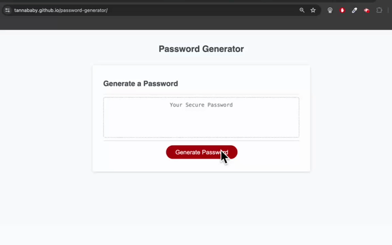

# Password-generator 🔐

## Deployed Website

https://tannababy.github.io/password-generator/

# Installation

N/A

## Description

In this week's challenge :star_struck:, we were tasked with creating an application that an employee can use to generate a random password based on criteria they’ve selected by modifying starter code provided to us.

Below is a screenshot of the mockup.
 
 

## Usage

The purpose of this app is to run in the browser and allow employees to generate a random password based on criteria selected from the options provided. The user is prompted to choose the password length within a given range, followed by a series of password criteria that will be used to randomly generate a new password each time.

## Credits

Overall guidance and provision of necessary materials for this challenge from the EdX Front-End Web Development Bootcamp instructor and teaching assistants (Oct2023 Cohort).

## License

Licensed under the MIT license.
